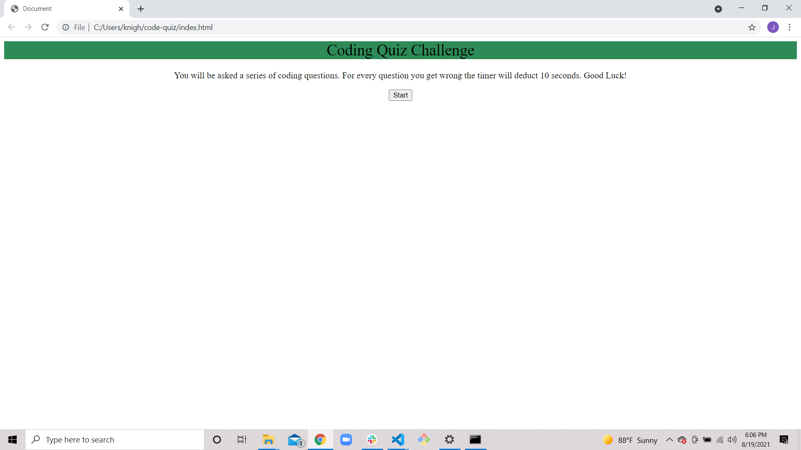

# code-quiz

## Description

- Our motivation behind this project was to test your knowledge on software         development. 

- We built this coding quiz to make sure that your software development knowledge is up to date. 

- I deepened my knowledge on writing JavaScript and connecting with my HTML by doing document.querySelector and storing what I'm grabbing from the HTML in a variable. 

## Usage 

- When you first hit the homepage you will read the instructions then press the start button. 

- After that you will be presented with your first question and a timer. 

- For every question that you get right your score will increase by 1 point. 

- For every question that you get wrong the timer will deduct 10 points but your score will stay the same. 

- When the game is over, input your initials to save your score. 

